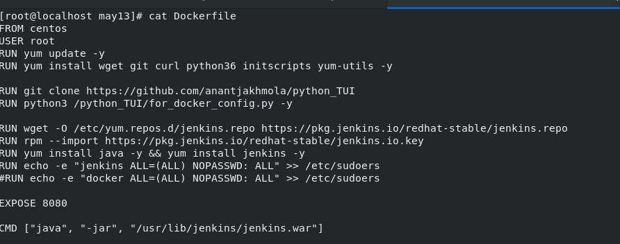
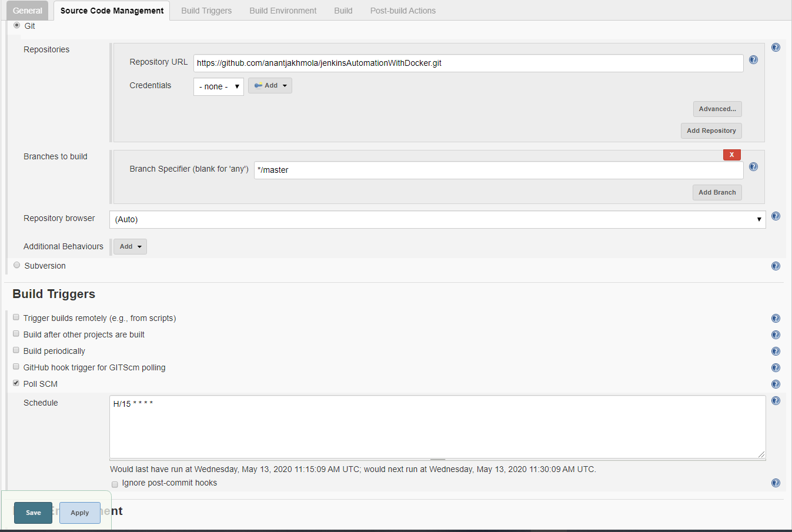
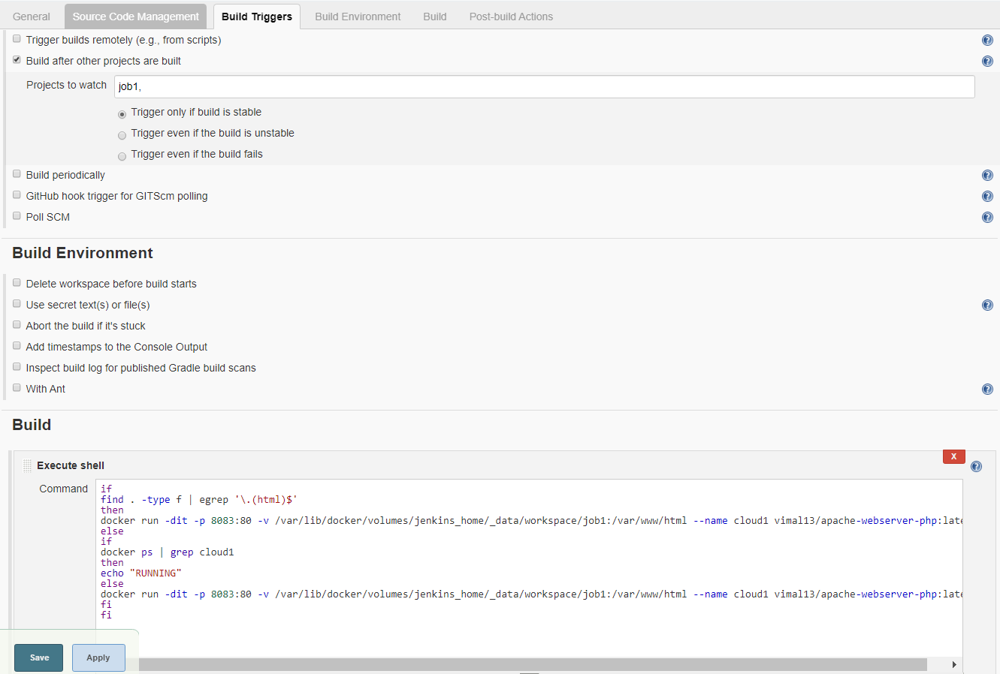
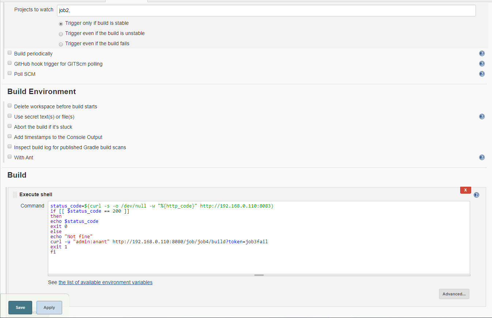
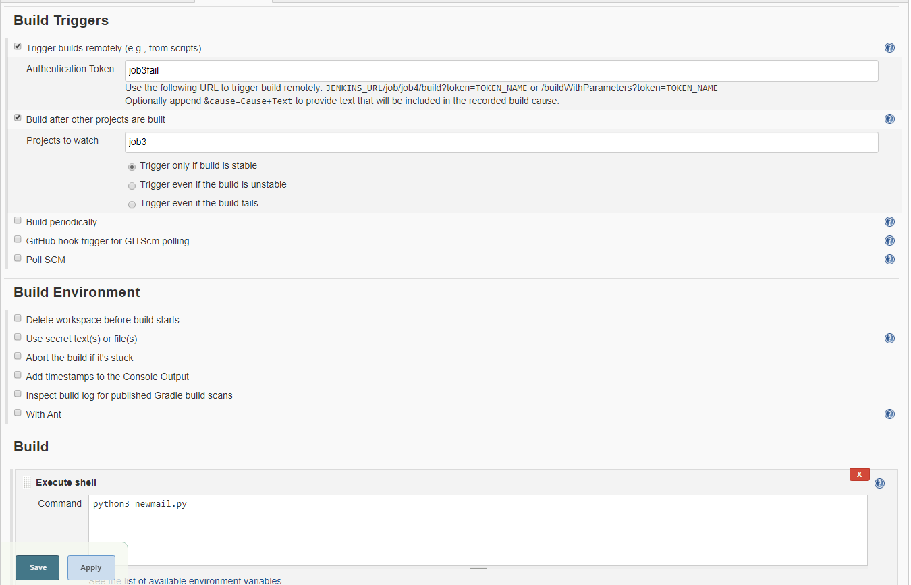
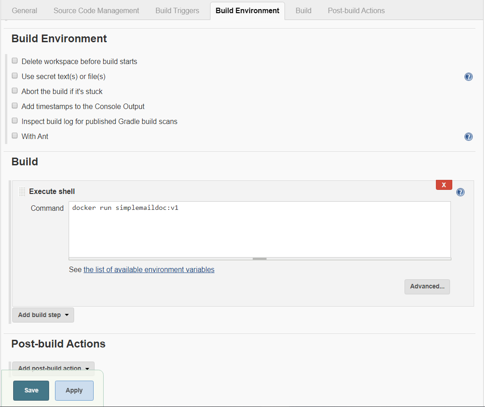

**TASK 2: DEVOPS ASSEMBLY LINE**

**A Step-By-Step Guide to use Jenkins in Docker and Docker inside
docker**

This guide is divided into 8 small parts you can use

1.Creating container image that has Jenkins installed using Dockerfile

cat \>\> Dockerfile

\# NOTE: To build the Dockerfile use the following the command

Docker build -t thanos:v1 .

*(Here I named the file as thanos:v1 you can use any name*

*If you are in the current directory use the (.) sign or use the full
path to build)*

2\. When we launch this image, it should automatically start Jenkins
service in the container.

***NOTE: MY image name is jenku although it's a funny name also I mapped
the docker.sock installed in the image to the real docker.sock in host
machine and also attached a volume Jenkins\_home from host to inside
docker container***

***You can also remove -p 50000:50000 ***

3.Creating a job chain of job1, job2, job3 and job4 using build pipeline
plugin in Jenkins

4.Job1 : Pull the GitHub repo automatically when some developers push
repo to GitHub.

*NOTE: I Have used Poll SCM you can also use triggers H/15 means this
job will run every 15 mins*

5.Job2 : By looking at the code or program file, Jenkins should
automatically start the respective language interpreter install image
container to deploy code ( E.g. If code is of html, then Jenkins should
start the container that has PHP already installed ).

This job will be triggered after job1

Here I am using vimal13/apache-webserver-php:latest as it was already
configured

6.Job3 : Test your app if it is working or not.

Here I am using a simple bash script to check that the site is working
fine or not

Status code 200 ensures that the working is fine.

7.Job4 : if app is not working , then send email to developer with error
messages.

Although I was not able to achieve this Step, but I think a script
should work fine. Although I will update it as soon as I resolve the
issue.

**UPDATE: ACHIEVED THIS JOB USING ANOTHER CONTAINER WITH PYTHON INSTALLED **

NOTE: You can also use email plugin in Jenkins ,at the time of writing
this mine was not working somehow.

8.Create One extra job job5 for monitor : If container where app is
running. fails due to any reason then this job should automatically
start the container again.

This will continuously monitor the job like Kubernetes and will restart
the image if it stopped by someone.
